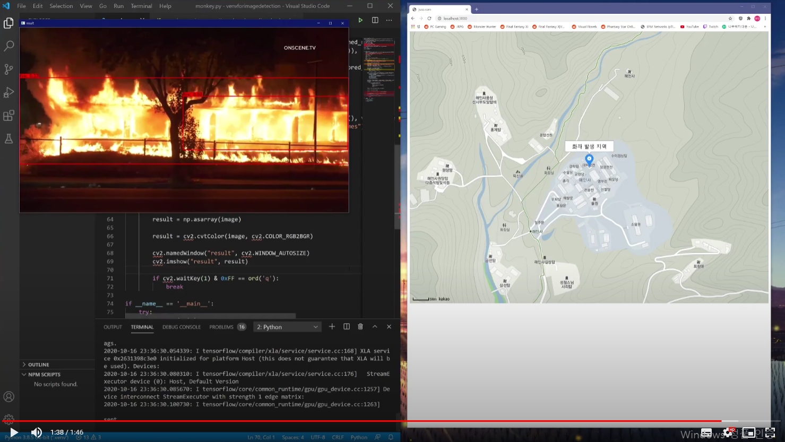

# KCFFireDetection
한국코드페어2020빌더스챌린지 출품작

프로그램 구조
--------------
이 프로그램은 두 개의 프로젝트로 나뉘어진다.

#### monkey.py
영상을 입력받고 영상에서 화재를 감지하는 역할을 한다.

monkey.py는 yolov4 weight를 tensorflow용으로 변환하여 화재 감지에 사용한다.

[이 링크](https://colab.research.google.com/drive/16XM8A53CNXX7NQi4yP4tBw6Modzgnf3m?usp=sharing)의 구글 코랩 노트북을 통해 구글의 클라우드 서버를 이용하여 weight를 training했다.

수백장의 화재 사진에 불이 난 부분을 표시한 뒤, 위의 코랩 노트북을 통해 클라우드에 화재 사진을 업로드하고 그 데이터를 통해 학습시킨 weight를 [tensorflow-yolov4-tflite](https://github.com/hunglc007/tensorflow-yolov4-tflite)을 통해 tensorflow용 weight로 변환하여 사용했다.

#### webandmapdispalay.html
monkey.py는 opencv, tensroflow, PIL등 여러 모듈을 사용하며, 이를 통해 입력받은 영상에서 화재를 감지하고 화면 상에 화재의 위치와 범위를 네모로 표시한 영상 화면을 출력한다. 그리고 화재가 감지되면 http의 post메소드로 javascirptoed폴더에 있는 서버 프로젝트에 주소를 보낸다.

서버 프로젝트는 html파일로 이루어져있다. webandmapdispalay.html는 웹페이지로, 카카오맵 api를 통해 지도를 보여준다. 이 페이지에서 백그라운드에 실행되는 스크립트가 일정 주기마다 post로 데이터가 전달 되었는지 확인하고, 있을 시 카카오맵 api에 받은 주소값의 위치를 표시한다.

실제 서버를 구축하여 웹사이트를 만들지 못하여 node.js로 테스팅을 해야 했고, 영상도 웹캠에서 실시간으로 입력받으며 테스트를 하지 못하고 녹화된 화재 영상을 사용하였지만 최소한의 기능을 넣고 주 기능인 화재 감지 및 주소 전송을 실현한 프로토타입으로서의 의의가 있다고 생각했다
